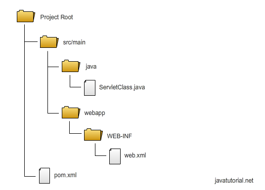
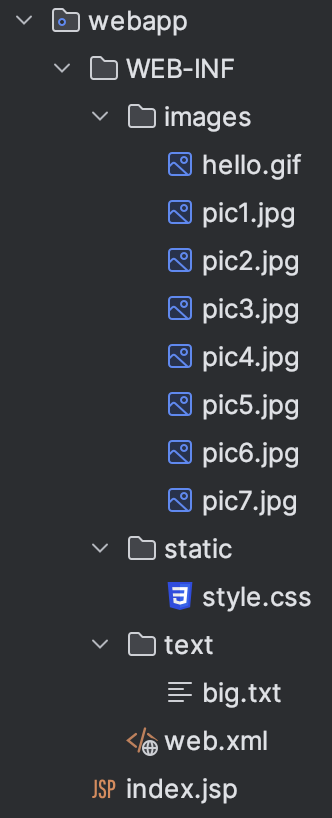
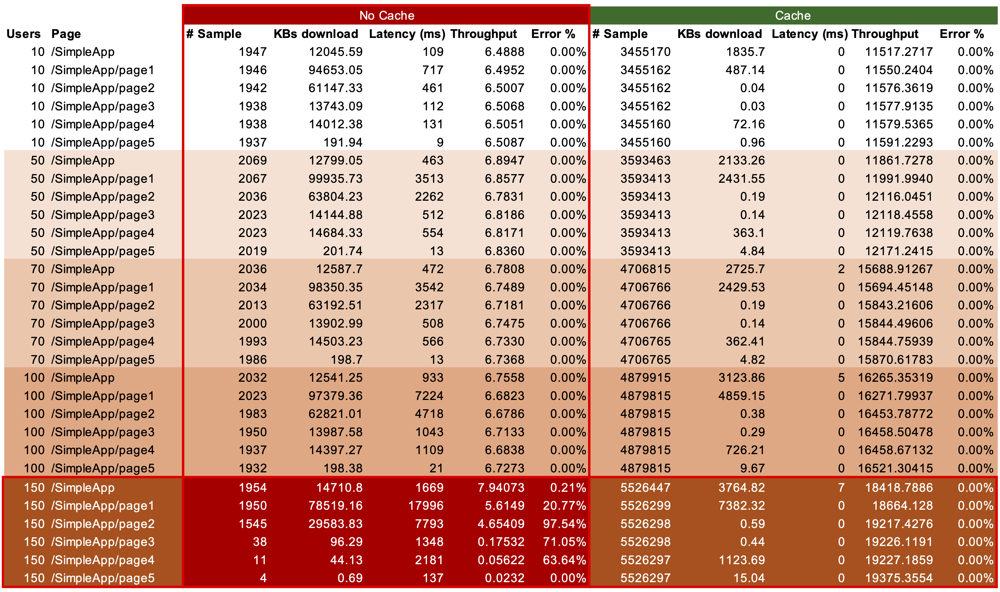

# Apache Tomcat 10


This project belongs to CS4675 SP24 Homework 4 Problem 2.

## Requirements

### General Requirements

-   Docker

    -   Docker Desktop can be found [here](https://www.docker.com/products/docker-desktop/)

-   JDK 8+
    -   Tested with Zulu21.30
    -   [Download Compatible Version with your Machine](https://www.azul.com/downloads/?package=jdk#zulu)
-   Maven
    -   Tested with version 3.9.6
    -   [Download Binary .tar.gz or .zip](https://maven.apache.org/download.cgi)

### Requirements for Hosting

-   Apache Tomcat 10+
    -   Tested with 10.1.19
    -   [Download Core .tar.gz or .zip](https://tomcat.apache.org/download-10.cgi)

### Requirements for Benchmark

-   Apache JMeter
    -   Tested with 5.6.3
    -   [Download Binaries .tgz or .zip](https://jmeter.apache.org/download_jmeter.cgi)

## Installation

In this project, to eliminate the complication of different OS. I have picked Docker to build and run the Tomcat server.

In the Project Root, there are 2 folders, both are able to build alone with Docker:

-   **/Non-Cache**: is the Tomcat server and the application without Cache implementation.
-   **/Cache**: is the Tomcat server and the application with Cache implementation.

Direct to the preferred version of Tomcat server and application, with Docker running, run the following command:

```bash
docker build -t <IMAGE_NAME> .
```

For example, I would like to build Tomcat with Caching, I would direct to Cache folder and run:

```bash
docker build -t apache-server-cache .
```

Build successful message look like:


Run the server and the application, run the following:

## Dockerfile

Build the application and process everything inside the Docker container:

```dockerfile
# Use the official OpenJDK image as the base image
FROM openjdk:23-jdk
# Copy the current directory contents into the container at /myapp
COPY . /myapp
# Set the working directory to /myapp
WORKDIR /myapp/SimpleApp
# Use Maven to build the application, produce a .WAR file
RUN ../apache-maven-3.9.6/bin/mvn clean package
# Copy the .WAR file to the Tomcat webapps directory
RUN cp target/SimpleApp-1.0-SNAPSHOT.war ../apache-tomcat-10.1.19/webapps/SimpleApp.war
RUN cp -R target/SimpleApp-1.0-SNAPSHOT ../apache-tomcat-10.1.19/webapps/SimpleApp
# Change the working directory to the Tomcat bin directory
WORKDIR /myapp/apache-tomcat-10.1.19/bin
# Make the shell scripts executable
RUN chmod +x *.sh
# Make port 8080 available to the world outside this container
EXPOSE 8080
# Run catalina.sh to start the Tomcat server
CMD ["./catalina.sh", "run"]
```

## Configuration

### Port Config

To configurate PORT, direct to `apache-tomcat-10.1.19` > `conf`. Open `server.xml` file, edit the port attribute on these lines:

```xml
<Connector port="8080" protocol="HTTP/1.1"
               connectionTimeout="20000"
               redirectPort="8443"
               maxParameterCount="1000"
               />
```

The port is set to `8080` by default. I can alter this port to 8081, 3000, etc. Save the file and keep it in the current directory. For an example, I can change to 3000 since I know port 3000 is currently free.

### Manager Config

We need this step to be able to view information or perform actions on our server.

To configurate MANAGER account, direct to `apache-tomcat-10.1.19` > `conf`. Open `tomcat-users.xml` file, add the following lines:

```xml
<tomcat-users>
...
<role rolename="manager-gui"/>
<user username="admin" password="admin" roles="manager-gui"/>
...
</tomcat-users>
```

You can change the `username` and `password` to your preferred ones. I personally set them both to admin.

## Create Servlet App

Since we will build the app with Maven, we need to follow some specific folder structure:



More on how to create a Servlet App on [JAVATUTORIAL.NET](https://javatutorial.net/java-servlet-example/)

In my project, I create a `GetObject.java` to read the data in the /webapp/WEB-INF directory. This class can get file types (JPG, PNG, GIF, TXT, CSS) only. To use this feature, when building the servlet, to display an image in images folder:

```java
String filePath = request.getContextPath() + "/getObject?name=image1.png";
out.println("");
```

-   `GetObject` will take in a parameter "name" is the filename with extension. With compatible extension, it will map to the right folder of that type and return if exists.
-   The purpose of `request.getContextPath()` is to get the full path of your server URL. Without it the browser would not know where the `/getObject` belongs to.
-   At the end of GetObject, I print out in console "return object" for the purpose of testing Cache.

Assets in /webapp/WEB-INF directory:



### How Page 1 looks like in coding?

```java
// GET /SimpleApp/page1
@WebServlet(name = "page1", value = "/page1")
public class Page1 extends HttpServlet {
    ...

    public void doGet(HttpServletRequest request, HttpServletResponse response) throws IOException {
        // Response Type, so the browser can render a website
        response.setContentType("text/html");

        PrintWriter out = response.getWriter();
        out.println("<html>");
        out.println(Nav.writeHeader(title));
        out.println("<body>");
        out.println(Nav.navBar()); // custom Nav Bar

        out.println("<h1>" + title + "</h1>");

        out.println("<div class='imagesContainer'>");
        for (Map.Entry<String, String> image : Nav.images.entrySet()) {
            out.println("<div class='card'>");
            out.println("");
            out.println("<p>"+image.getKey()+"</p>");
            out.println("</div>");
        }
        out.println("</div>");

        out.println("</body></html>");
    }
}
```

## Run the Server and the App

There are 2 apps:

-   Non-Caching with Docker Image Name: apache-server
-   Caching with Docker Image Name: apache-server-caching

Use the Terminal command to run the desired service:

```bash
docker run -p 8080:8080 <IMAGE_NAME>
```

Here the server run inside Docker container on port 8080, and we want to map that 8080 port to the outside environment at port 8080. If I configurate Tomcat to port 3000, and I want to expose to outside port 8080, I can run the similar command:

```bash
docker run -p 8080:3000 <IMAGE_NAME>
```

## Testing on iPhone Device

Imagine your laptop is a server, it will available to all devices in the same network.

Find your server's IP address within the network by [many methods](https://www.avast.com/c-how-to-find-ip-address)

For me, my laptop IP address is `128.61.32.180`, to access from other devices:

    http://128.61.32.180:8080/SimpleApp

### In this particular project, I have 6 pages:

### Homepage: includes links to pages + a GIF image


### Page 1: load all the images in images folder


### Page 2: load only 4 images from the images folder


### Page 3: display a random image from images folder


### Page 4: load a txt file from text folder


### Page 5: randomize 1,000 integers and display them


## Cache Setup

To allow caching, we need to configurate the App's `web.xml` in `SimpleApp/src/main/webapp/WEB-INF/`:

```xml
<web-app>
...
 <filter>
        <filter-name>ExpiresFilter</filter-name>
        <filter-class>org.apache.catalina.filters.ExpiresFilter</filter-class>
        <init-param>
        <!-- Make html expires in 10 minutes -->
            <param-name>ExpiresByType text/html</param-name>
            <param-value>access plus 10 minutes</param-value>
        </init-param>
        <init-param>
        <!-- Make xml expires in 10 minutes -->
            <param-name>ExpiresByType text/xml</param-name>
            <param-value>access plus 10 minutes</param-value>
        </init-param>
        <init-param>
        <!-- Make image expires in 10 minutes -->
            <param-name>ExpiresByType image</param-name>
            <param-value>access plus 10 days</param-value>
        </init-param>
        <init-param>
        <!-- Make css expires in 10 minutes -->
            <param-name>ExpiresByType text/css</param-name>
            <param-value>access plus 10 hours</param-value>
        </init-param>
        <init-param>
        <!-- Make javascript expires in 10 minutes -->
            <param-name>ExpiresByType application/javascript</param-name>
            <param-value>access plus 10 minutes</param-value>
        </init-param>
        <init-param>
        <!-- Make other files expires in 10 minutes -->
            <param-name>ExpiresDefault</param-name>
            <param-value>access plus 10 minutes</param-value>
        </init-param>
    </filter>

    <filter-mapping>
        <filter-name>ExpiresFilter</filter-name>
        <url-pattern>/*</url-pattern>
        <dispatcher>REQUEST</dispatcher>
    </filter-mapping>
</web-app>
```

In `jmeter/bin`, configurate `user.properties` file by add these lines to properly caching the website. Add these lines:

```properties
cache_manager.cached_resource_mode=RETURN_CUSTOM_STATUS
RETURN_CUSTOM_STATUS.code=304
RETURN_CUSTOM_STATUS.message=Resource in cache
```

### Why this?

Based on Jmeter documentation:

    N.B. This property is currently a temporary solution for Bug 56162.

More information: https://jmeter.apache.org/usermanual/properties_reference.html#cache_manager

### What is 304?

    The HTTP 304 Not Modified client redirection response code indicates that there is no need to retransmit the requested resources.

## Testing Setup

## Test Setup with JMeter

There are 5 threads, each thread is a test. Right click to create a Thread Group.


Configurate the thread group to get the desired test setting:


On the Basic tab of the HTTP Request, configurate the request pointing to your site:


Switch to Advanced Tab to Allow retrieve all objects like images, css, txt, etc. to get a proper statistic.


### Non-Caching Tests Setup

-   Latency and throughput tests include the test on 10 concurrent users.
-   Stress tests include 50 users, 70 users, 100 users, and 150 users.
-   All users running at the same time, request at the same time in 5 minutes.
-   Each users keep requesting 6 pages.
-   Recording amount of received data, timing, content, etc.

Each test will look like:


### Caching Tests Setup

-   Latency and throughput tests include the test on 10 concurrent users.
-   Stress tests include 50 users, 70 users, 100 users, and 150 users.
-   All users running at the same time, request at the same time in 5 minutes.
-   Each users keep requesting 6 pages.
-   Recording amount of received data, timing, content, etc.
-   Include HTTP Cache Manager to properly cache the sites and record statistic.

Each test will look like below.


## Performance



## Performance Testing without Cache

-   Average **Throughput** (10 Users = 11648 requests): 6 requests/second.
-   **Latency** each page is the average time in (ms) to load each request:
    -   Homepage: 109 ms
    -   Page 1: 717 ms
    -   Page 2: 461 ms
    -   Page 3: 112 ms
    -   Page 4: 131 ms
    -   Page 5: 9 ms

A few thing we can observe here:

-   From 10 to 100 Users Tests, Number of Sample and KBs Download don't change significantly.
-   The Latency increases as the number of number of users increase.
-   The Throughput is likely to be the same as the number of users increase.
-   Look like there are no errors during each test.
-   When there are 150 users:
    -   The numbers of samples start to drop significantly.
    -   The server starts failing on process requests, results in KBs download drops.
    -   Latency increases significantly, more than 10x times 10 users.
    -   Throughput is inconsistent and tend to drop by a large amount.
    -   Error % increases as the test running. Some pages get up to 90% of errors.

## Performance Testing with Cache

-   Average **Throughput** (10 Users ~ 3.5 million requests): 11565 requests/second.

-   **Latency** each page is the average time in (ms) to load each request:
    -   Homepage: 0 ms
    -   Page 1: 0 ms
    -   Page 2: 0 ms
    -   Page 3: 0 ms
    -   Page 4: 0 ms
    -   Page 5: 0 ms

Why?

-   The first time the latency can be a large number.
-   However, each future requests will be served from the caches. Which take a very small amount of time.
-   As the time goes by, the average will keep decreasing to a very small number close to 0.

A few thing we can observe here:

-   From 10 to 150 Users Tests, Number of Sample and KBs Download keep increasing if there are more users.
-   KBs Download increases not because of the images, or html, or text. But there are some objects are not significantly effects the performance, therefore they are not being taken care of.
-   However, KBs Download is change slightly increase we increase the users.
-   The Latency is a very small number (close to 0).
-   As number of users increase, the Throughput increases.
-   Look like there are no errors during each test.

## Discussion

1. Cache is a very important setup for website:

    - Without Caching with the more users, the server will not able to handle the request. The more users, the more requests will stress out the server. Make it process each request longer than usual, results in Latency of the 100 Users `10x times` the Latency of the 10 Users requests.
        - We thought that increasing the number of requests can increase number of throughput. However, the higher number of requests doesn't mean the server can process them faster because the performance of the server is still the same but it has to to do more works which is impossible to increase throughput.
    - When there are 150 users in No-Caching server. The server cannot handle the works properly and cannot respond to the client on time. Therefore, after a number of Time-to-Live, the client do not receive the respond from the server. The client starts to throw errors. The throughput in the Homepage is still relevent to other tests. But we set up 150 users, the first homepage can be acquire by others users, the server has to process for that many users, leaving behind page 1, page 2, etc until they all are expired before receving the responds.
    - Caching change everything, the content is served directly from the memory saving a lot of requests/responds between the server and the client.
        - Even I increase 10 to 150 users at a time, the server only process the information once and give them Time-to-Live until the contents expire.
        - The Error is almost perfectly 0% since there are no round-trip between client-server after the first time visiting the site.
        - Since the content is served from memory, the latency is significantly drop to 0 which mean there look like no interaction between server and client because the content is sitll new.
        - Throughput is something impressive. The more users, the higher throughput.
    - Caching impact significantly the Error.
        - If there are no caching, the users keep asking for the contents while the server is not able to handle the images. At some points, the server cannot serve anymore, no caching, and the website will crash/ fail to respond on time.

2. URL

3. Convert to Base64
