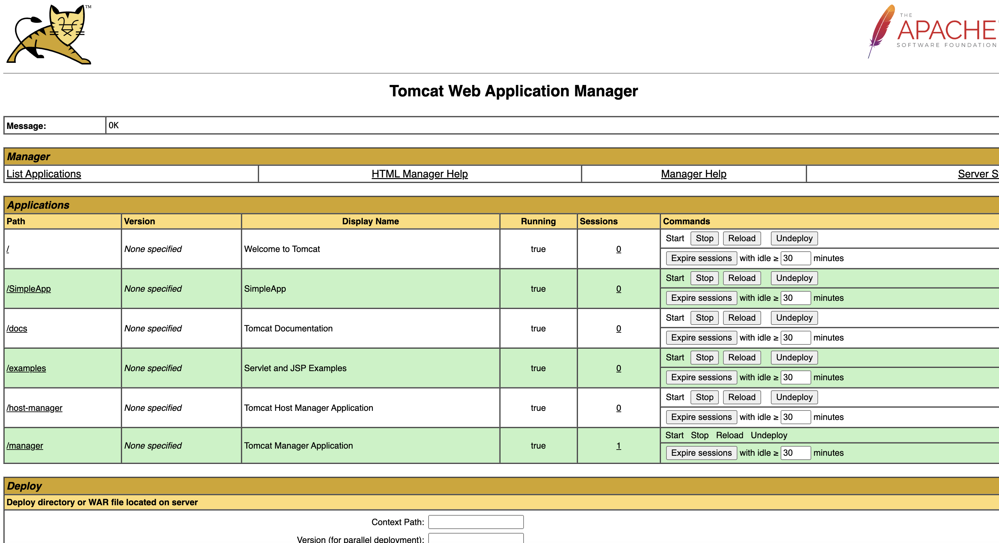

# Apache Tomcat 10


This project belongs to CS4675 SP24 Homework 4 Problem 2.

## Requirements

### General Requirements

-   Docker

    -   Docker Desktop can be found [here](https://www.docker.com/products/docker-desktop/)

-   JDK 8+

    -   Tested with Zulu21.30

    -   [Download Compatible Version with your Machine](https://www.azul.com/downloads/?package=jdk#zulu)

-   Maven

    -   Tested with version 3.9.6

    -   [Download Binary .tar.gz or .zip](https://maven.apache.org/download.cgi)

### Requirements for Hosting

-   Apache Tomcat 10+

    -   Tested with 10.1.19

    -   [Download Core .tar.gz or .zip](https://tomcat.apache.org/download-10.cgi)

### Requirements for Benchmark

-   Apache JMeter

    -   Tested with 5.6.3

    -   [Download Binaries .tgz or .zip](https://jmeter.apache.org/download_jmeter.cgi)

-   Test Files to run in JMeter:

    -   [NO-CACHE.jmx](./Tests/NO-CACHE.jmx) tests no caching implementation.

    -   [CACHE.jmx](./Tests/CACHE.jmx) tests with caching implementation.

## Installation

In this project, to eliminate the complication of different OS. I have picked Docker to build and run the Tomcat server.

In the Project Root, there are 2 folders, both are able to build alone with Docker:

-   **/Non-Cache**: is the Tomcat server and the application without Cache implementation.

-   **/Cache**: is the Tomcat server and the application with Cache implementation.

Direct to the preferred version of Tomcat server and application, with Docker running, run the following command:

```bash
docker  build  -t  <IMAGE_NAME>  .
```

For example, I would like to build Tomcat with Caching, I would direct to Cache folder and run:

```bash
docker  build  -t  apache-server-cache  .
```

Build successful message look like:


Run the server and the application, run the following:

## Dockerfile

Build the application and process everything inside the Docker container:

```dockerfile
# Use the official OpenJDK image as the base image
FROM openjdk:23-jdk

# Copy the current directory contents into the container at /myapp
COPY . /myapp

# Set the working directory to /myapp
WORKDIR /myapp/SimpleApp

# Use Maven to build the application, produce a .WAR file
RUN ../apache-maven-3.9.6/bin/mvn clean package

# Copy the .WAR file to the Tomcat webapps directory
RUN cp target/SimpleApp-1.0-SNAPSHOT.war ../apache-tomcat-10.1.19/webapps/SimpleApp.war

RUN cp -R target/SimpleApp-1.0-SNAPSHOT ../apache-tomcat-10.1.19/webapps/SimpleApp
# Change the working directory to the Tomcat bin directory

WORKDIR /myapp/apache-tomcat-10.1.19/bin
# Make the shell scripts executable

RUN chmod +x *.sh
# Make port 8080 available to the world outside this container

EXPOSE 8080
# Run catalina.sh to start the Tomcat server

CMD ["./catalina.sh", "run"]
```

## Configuration

### Port Config

To configurate PORT, direct to `apache-tomcat-10.1.19` > `conf`. Open `server.xml` file, edit the port attribute on these lines:

```xml
<Connector  port="8080"  protocol="HTTP/1.1"
            connectionTimeout="20000"
            redirectPort="8443"
            maxParameterCount="1000"
/>
```

The port is set to `8080` by default. I can alter this port to 8081, 3000, etc. Save the file and keep it in the current directory. For an example, I can change to 3000 since I know port 3000 is currently free.

### Manager Config

We need this step to be able to view information or perform actions on our server.

To configurate MANAGER account, direct to `apache-tomcat-10.1.19` > `conf`. Open `tomcat-users.xml` file, add the following lines:

```xml
<tomcat-users>
...
<role  rolename="manager-gui"/>
<user  username="admin"  password="admin"  roles="manager-gui"/>
...
</tomcat-users>
```

You can change the `username` and `password` to your preferred ones. I personally set them both to admin.

### Access Server as Manager

```text
http://<IP_ADDRESS>:<PORT>/manager
```

For local machine, use `http://127.0.0.1:8080/manager` and use your `manager-gui` username and password to access manager dashboard.



Use this link to explore the Manager GUI [https://www.baeldung.com/tomcat-manager-app](https://www.baeldung.com/tomcat-manager-app)

## Create Servlet App

Since we will build the app with Maven, we need to follow some specific folder structure:


More on how to create a Servlet App on [JAVATUTORIAL.NET](https://javatutorial.net/java-servlet-example/)

In my project, I create a `GetObject.java` to read the data in the /webapp/WEB-INF directory. This class can get file types (JPG, PNG, GIF, TXT, CSS) only. To use this feature, when building the servlet, to display an image in images folder:

```java
String filePath = request.getContextPath() +  "/getObject?name=image1.png";
out.println("");
```

-   The `GetObject` function will take a parameter called "name" which represents the filename with its extension. If the extension is compatible, it will be mapped to the corresponding folder of that type and returned if it exists.

-   The purpose of using `request.getContextPath()` is to retrieve the full path of the server URL. Without it, the browser would not know where the `/getObject` resource belongs.

-   At the end of the `GetObject` function, I print out "return object" in the console for the purpose of testing the cache.

Assets in /webapp/WEB-INF directory:


### How Every Page Looks Like?

Each Java file will have its request subdirectory. For page 1, it subdirectory is `/page1`.

Full URL will be: `<SERVER_DOMAIN>:<PORT>/SimpleApp/page1`

```java
// GET /SimpleApp/page1
@WebServlet(name = "page1", value = "/page1")

public class Page1 extends HttpServlet {
  ...
      public void
      doGet(HttpServletRequest request, HttpServletResponse response)
          throws IOException {
    // Response Type, so the browser can render a website
    response.setContentType("text/html");

    PrintWriter out = response.getWriter();

    out.println("<html>");
    out.println(Nav.writeHeader(title)); // custom header
    out.println("<body>");
    out.println(Nav.navBar()); // custom Nav Bar
    out.println("<h1>" + title + "</h1>");
    out.println("<div class='imagesContainer'>");

    for (Map.Entry<String, String> image : Nav.images.entrySet()) {
      out.println("<div class='card'>");
      out.println("");
      out.println("<p>" + image.getKey() + "</p>");
      out.println("</div>");
    }
    out.println("</div>");
    out.println("</body></html>");
  }
}
```

## Run the Server and the App

There are 2 apps:

-   Non-Caching with Docker Image Name: apache-server

-   Caching with Docker Image Name: apache-server-caching

Use the Terminal command to run the desired service:

```bash
docker  run  -p  8080:8080  <IMAGE_NAME>
```

Here, the server runs inside a Docker container on port 8080, and we aim to map that port (8080) to the external environment at the same port (8080). If I configure Tomcat to use port 3000, but I intend to expose it to the external environment on port 8080, I can execute a similar command:

```bash
docker  run  -p  8080:3000  <IMAGE_NAME>
```

## Testing on iPhone Device

Imagine your laptop is a server, it will available to all devices in the same network.

Find your server's IP address within the network by [many methods](https://www.avast.com/c-how-to-find-ip-address)

For me, my laptop IP address is `128.61.32.180`, to access from other devices:

http://128.61.32.180:8080/SimpleApp

### In this particular project, I have 6 pages:

### Homepage: includes links to pages + a GIF image


### Page 1: load all the images in images folder


### Page 2: load only 4 images from the images folder


### Page 3: display a random image from images folder


### Page 4: load a txt file from text folder


### Page 5: randomize 1,000 integers and display them


## Cache Setup

To allow caching, we need to configurate the App's `web.xml` in `SimpleApp/src/main/webapp/WEB-INF/`:

```xml
<web-app>
...

<filter>
<filter-name>ExpiresFilter</filter-name>
<filter-class>org.apache.catalina.filters.ExpiresFilter</filter-class>
<init-param>

<!-- Make html expires in 10 minutes -->
<param-name>ExpiresByType text/html</param-name>
<param-value>access plus 10 minutes</param-value>
</init-param>
<init-param>

<!-- Make xml expires in 10 minutes -->
<param-name>ExpiresByType text/xml</param-name>
<param-value>access plus 10 minutes</param-value>
</init-param>
<init-param>

<!-- Make image expires in 10 minutes -->
<param-name>ExpiresByType image</param-name>
<param-value>access plus 10 days</param-value>
</init-param>
<init-param>

<!-- Make css expires in 10 minutes -->
<param-name>ExpiresByType text/css</param-name>
<param-value>access plus 10 hours</param-value>
</init-param>
<init-param>

<!-- Make javascript expires in 10 minutes -->
<param-name>ExpiresByType application/javascript</param-name>
<param-value>access plus 10 minutes</param-value>
</init-param>
<init-param>

<!-- Make other files expires in 10 minutes -->
<param-name>ExpiresDefault</param-name>
<param-value>access plus 10 minutes</param-value>
</init-param>
</filter>

<filter-mapping>
<filter-name>ExpiresFilter</filter-name>
<url-pattern>/*</url-pattern>
<dispatcher>REQUEST</dispatcher>
</filter-mapping>

</web-app>
```

In `jmeter/bin`, configurate `user.properties` file by add these lines to properly caching the website. Add these lines:

```properties
cache_manager.cached_resource_mode=RETURN_CUSTOM_STATUS
RETURN_CUSTOM_STATUS.code=304
RETURN_CUSTOM_STATUS.message=Resource in cache
```

### Why this?

Based on Jmeter documentation:

N.B. This property is currently a temporary solution for Bug 56162.

More information: https://jmeter.apache.org/usermanual/properties_reference.html#cache_manager

### What is 304?

The HTTP 304 Not Modified client redirection response code indicates that there is no need to retransmit the requested resources.

## Testing Setup

## Run JMeter

Direct to JMeter directory, go to `bin` folder. For Windows User, simple click on `jmeter.bat` to run.

For MacOS and Linux users, give executable permission to `.sh` files with commands:

```bash

chmod  +x  *.sh

```

Run `jmeter.sh` using:

```bash

./jmeter.sh

```

## Test Setup with JMeter

There are 5 threads, each thread is a test. Right click to create a Thread Group.


Configurate the thread group to get the desired test setting:


On the Basic tab of the HTTP Request, configurate the request pointing to your site:


Switch to Advanced Tab to Allow retrieve all objects like images, css, txt, etc. to get a proper statistic.


### Non-Caching Tests Setup

-   Latency and throughput tests include the test on 10 concurrent users.

-   Stress tests include 50 users, 70 users, 100 users, and 150 users.

-   All users running at the same time, request at the same time in 5 minutes.

-   Each users keep requesting 6 pages.

-   Recording amount of received data, timing, content, etc.

Each test will look like:


### Caching Tests Setup

-   Latency and throughput tests include the test on 10 concurrent users.

-   Stress tests include 50 users, 70 users, 100 users, and 150 users.

-   All users running at the same time, request at the same time in 5 minutes.

-   Each users keep requesting 6 pages.

-   Recording amount of received data, timing, content, etc.

-   Include HTTP Cache Manager to properly cache the sites and record statistic.

Each test will look like below.


### Open my provided Tests Package in the Requirements section above in JMeter.

###  Run the Tests

On the navigation bar in Jmeter, navigate to the Green Button to run your tests.

## Performance


## Performance Testing without Cache

-   Average **Throughput** (10 Users = 11648 requests): 6 requests/second.

-   **Latency** for each page is the average time (in ms) to load each request:

-   Homepage: 109 ms

-   Page 1: 717 ms

-   Page 2: 461 ms

-   Page 3: 112 ms

-   Page 4: 131 ms

-   Page 5: 9 ms

A few things we can observe here:

-   From 10 to 100 Users Tests, the number of samples and KBs Download don't change significantly.

-   The Latency increases as the number of users increase.

-   The Throughput is likely to be the same as the number of users increase.

-   It seems there are no errors during each test.

-   When there are 150 users:

-   The number of samples starts to drop significantly.

-   The server starts failing to process requests, resulting in KBs download drops.

-   Latency increases significantly, more than 10 times that of 10 users.

-   Throughput is inconsistent and tends to drop by a large amount.

-   Error % increases as the test runs. Some pages get up to 90% of errors.

Response Time for 50 users over 5 minutes.


## Performance Testing with Cache

-   Average **Throughput** (10 Users ~ 3.5 million requests): 11565 requests/second.

-   **Latency** for each page is the average time (in ms) to load each request:

-   Homepage: 0 ms

-   Page 1: 0 ms

-   Page 2: 0 ms

-   Page 3: 0 ms

-   Page 4: 0 ms

-   Page 5: 0 ms

Why?

-   The first time the latency can be a large number.

-   However, each future request will be served from the caches. Which takes a very small amount of time.

-   As time goes by, the average will keep decreasing to a very small number close to 0.

A few things we can observe here:

-   From 10 to 150 Users Tests, the number of samples and KBs Download keeps increasing if there are more users.

-   KBs Download increases not because of the images, HTML, or text. But there are some objects that are not significantly affecting the performance, therefore they are not being taken care of.

-   However, KBs Download slightly increases as we increase the number of users.

-   The Latency is a very small number (close to 0).

-   As the number of users increase, the Throughput increases.

-   It seems there are no errors during each test.

Response Time for 50 users over 5 minutes.


## Discussion

This project has provided a practical understanding of web server operations, performance optimization techniques like caching, and the importance of load testing in assessing server performance.

### 1. Cache Is Important for High Traffic Website:

-   Without caching, with more users, the server will not be able to handle the requests. The more users, the more requests will stress out the server, making it process each request longer than usual. This results in latency for 100 users being 10 times the latency of the 10 user requests.

-   We thought that increasing the number of requests can increase the throughput. However, the higher number of requests doesn't mean the server can process them faster because the performance of the server remains the same, but it has to do more work, which is impossible to increase throughput.

-   When there are 150 users in a non-caching server, the server cannot handle the workload properly and cannot respond to the client on time. Therefore, after a number of Time-to-Live periods, the client does not receive a response from the server. The client starts to throw errors. The throughput on the homepage is still relevant to other tests. But we set up 150 users, the first homepage can be acquired by other users, the server has to process for that many users, leaving behind pages 1, 2, etc. until they all expire before receiving the response.

-   Caching changes everything; the content is served directly from memory, saving a lot of requests/responses between the server and the client.

-   Even if I increase from 10 to 150 users at a time, the server only processes the information once and gives them a Time-to-Live until the contents expire.

-   The error rate is almost perfectly 0% since there are no round trips between client-server after the first time visiting the site.

-   Since the content is served from memory, the latency significantly drops to 0, which means there appears to be no interaction between the server and client because the content is still new.

-   Throughput is something impressive: the more users, the higher the throughput.

-   Caching improves the error percentage significantly.

-   If there is no caching, users keep asking for the contents while the server is not able to handle the images. At some points, the server cannot serve anymore, with no caching, and the website will crash/fail to respond on time.

### 2. Retrieving Resources/Assets Is Very Crucial

First use Bare directory to image but not able to display. I tried a few of the directory like:

-   `/SimpleApp/src/main/webapp/WEB-INF/images/hello.gif`

-   `webapp/WEB-INF/images/hello.gif`

-   `WEB-INF/images/hello.gif`

Even I put the Docker container directory, the browser will combine your current URL + your directory:

-   `<DOMAIN>:<PORT>/<BARE_URL>`


This way is like the website on the client side is requesting contents from the server storage, but accessing the server is not just a directory. We need to do more work than that in a JavaScript script. Therefore, I need to process the images on the server and send the complete one to the client.

I know there is a method to display images as Base64. I attempted to try this method ([TUTORIAL](https://www.tutorialspoint.com/how-to-display-base64-images-in-html)). The image is displayed perfectly.

This prevents the page from loading slowly and saves the web browser from additional HTTP requests.

```html
" <OTHER_ATTRIBUTES /> />
```

However, I am concerned about Caching Issues. Even though it is stated above that it prevents the page from loading slowly, Cache is still better since it won't need the server to process the data to Base64 again. My concern is VALID. Based on [Bunny.net](https://bunny.net/blog/why-optimizing-your-images-with-base64-is-almost-always-a-bad-idea/#:~:text=Caching%20Issues&text=Due%20to%20how%20Base64%20works,as%20increases%20your%20bandwidth%20bill.)

Due to how Base64 works, the browser is unable to store the images locally, so it will always need to fetch them from your server or CDN, which creates extra load on your server as well as increases your bandwidth bill.

When I looked at the Developer Tools, the HTML grows pretty big, and it will absolutely affect the load and render time. It's time to learn something else. I did a little research and found [Servlet - Display Image - GeeksforGeeks](https://www.geeksforgeeks.org/servlet-display-image/). This method only processes the images in general. However, I altered it a little to be able to get all of my necessary files like CSS, TEXT, etc.

```java
// /getObject?name=....
@WebServlet(name = "getObject", value = "/getObject")

public class GetObject extends HttpServlet {
  public void doGet(HttpServletRequest request, HttpServletResponse response)
      throws IOException {
    // take in file name with its extension
    String fileName = request.getParameter("name");
    // Notify if there is a request for Object
    System.out.println("Return Object: " + fileName);
    // support TXT by default
    String contentType = "text/plain";
    String storagePath = "/WEB-INF/text";
    // support JPG, PNG, JPEG, GIF only
    if (fileName.endsWith(".jpg")
        || fileName.endsWith(".png")
        || fileName.endsWith(".gif")
        || fileName.endsWith("jpeg")) {
      contentType = "image/jpeg";
      storagePath = "/WEB-INF/images";
      // support CSS
    } else if (fileName.endsWith(".css")) {
      contentType = "text/css";
      storagePath = "/WEB-INF/static";
    }
    // PROCESS ASSETS AND RETURN IT
  }
}
```

Using this method, we allow the server to take the object and send it to client. At the same time, this method allows the Cache if we turn on the Caching Option on the Application (using the method mention above)

#### How to know when it caches or no cache?

For Cache, when running the webapp, my GetObject function will prinout in the console every time it process an object:


or we can use browser developer mode to check the Cache:


For Non-Cache, the console will look like:


### 3. Stress Tests Should NOT Always in Perfect Environments

Along with my experiences with setting up JMeter and conducting tests as described above, I used another laptop running Ubuntu to run JMeter on my server hosted on a Mac Laptop. The router is an ATT BGW320. Additionally, in this environment, there are other devices like TVs, laptops, phones, another router, cameras, etc., which make it harder to deliver packages in the stress tests. Let's take a look at what happens when the number of users grows to 70 and I turned off the option to retrieve all the embedded objects. The server starts to not process some requests, making the Error % for Page 5 reach 4% out of 878 samples.

| Label    | # Samples | Latency | Error % | Throughput | Received KB/sec |
| -------- | --------- | ------- | ------- | ---------- | --------------- |
| HomePage | 922       | 2645    | 0.00%   | 3.0458     | 3.02            |
| Page1    | 912       | 1246    | 0.00%   | 3.02481    | 4.22            |
| Page2    | 904       | 1272    | 0.00%   | 3.00331    | 3.21            |
| Page3    | 899       | 1310    | 0.00%   | 2.97337    | 2.32            |
| Page4    | 895       | 7670    | 0.00%   | 2.94164    | 6333.57         |
| Page5    | 878       | 2597    | 3.99%   | 2.91675    | 80.12           |

Starting with 100 users, the network starts to act slowly. 45,502 samples are waiting to be processed and sent over the network. The router starts doing a bad job in routing the data. The slowness and improper delivery of data cause approximately 40,000 samples to become stuck, after which it keeps trying new samples. This significantly impacts other pages, causing them to wait for their turn. The Error % of the first page reaches up to 99.78%. We can assume that the tests fail when there is 100% congestion over a home network.

| Label    | # Samples | Latency | Error % | Throughput | Received KB/sec |
| -------- | --------- | ------- | ------- | ---------- | --------------- |
| HomePage | 45502     | 65      | 99.78%  | 544.39951  | 1353.85         |
| Page1    | 101       | 776     | 0.99%   | 1.55826    | 2.18            |
| Page2    | 100       | 336     | 0.00%   | 26.22607   | 28.07           |
| Page3    | 100       | 465     | 0.00%   | 19.03312   | 14.88           |
| Page4    | 100       | 48967   | 95.00%  | 1.54495    | 168.16          |
| Page5    | 5         | 2044    | 0.00%   | 0.93318    | 26.63           |

The web server needs a dedicated performance machine and a consistent network. For a toy web server in a home network, the ATT BGW320 can only handle about 80 devices with a high error %. 100 Users make it impossible for a home router.
